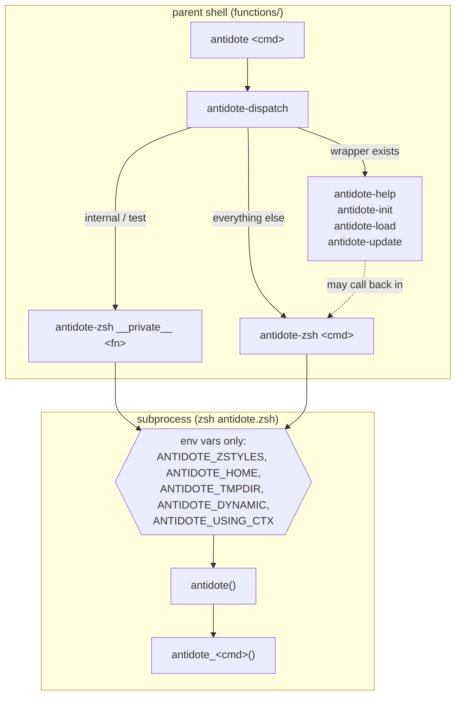
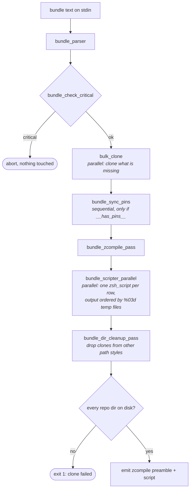
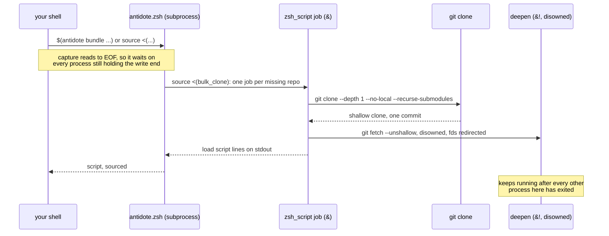
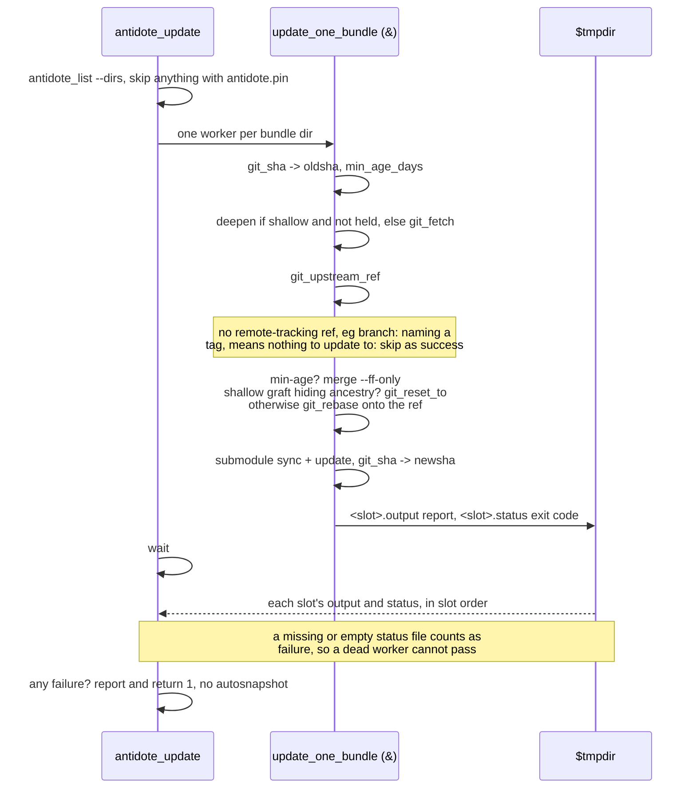

# antidote architecture

This is the orientation map for the codebase. Start here instead of reading the whole
tree. Line numbers drift as the code moves, so the stable anchors are function names and
the `##### SECTION` banners in [antidote.zsh](antidote.zsh).

antidote is a Zsh plugin manager. Its job is small and specific: take a plugins file
(`.zsh_plugins.txt`) and turn it into a generated static Zsh script that sources
plugins, and clone or update the git repos those plugins live in. Most design decisions
trace back to keeping Zsh startup fast, so when the code looks roundabout the reason is
usually that the direct version costs a fork or does work at startup that can be done
ahead of time.

## File map

| Path                                         | Role                                                                              |
| -------------------------------------------- | --------------------------------------------------------------------------------- |
| [antidote](antidote)                         | Standalone shim. Sources `antidote.zsh`, calls `antidote-dispatch`. Not on `PATH` |
| [antidote.zsh](antidote.zsh)                 | The whole engine. Runs as a **subprocess**, not in the user's shell (<2000 sloc)  |
| [functions/](functions/)                     | Autoloaded functions that must run **in the parent shell**                        |
| [templates/config.zsh](templates/config.zsh) | User-facing config template documenting every public zstyle                       |
| [man/\*.adoc](man/)                          | Man page sources. `man/man1/*.1` is generated, never edit it                      |
| [tools/](tools/)                             | `buildman` (asciidoctor man build), `bumpver`, `antidote-profile`, `sloc`         |
| [tests/](tests/)                             | bats suite + runner. See [Testing](#testing)                                      |
| [justfile](justfile)                         | Task entry point. Everything runs through `just`                                  |

### functions/

| File                      | Runs in | Purpose                                                                       |
| ------------------------- | ------- | ----------------------------------------------------------------------------- |
| `antidote`                | parent  | Function form of the shim, so `autoload -Uz antidote` works from fpath        |
| `antidote-setup`          | parent  | Sets `ANTIDOTE_ZSH`, fpath, MANPATH, `_adote_zparopt_flags`. Called on source |
| `antidote-dispatch`       | parent  | Router. Decides parent-shell function vs subprocess                           |
| `antidote-zsh`            | parent  | Serializes zstyles into env, runs `zsh $ANTIDOTE_ZSH "$@"`                    |
| `antidote-load`           | parent  | `antidote load`: staleness check, generate static file, `source` it           |
| `antidote-update`         | parent  | `antidote update`: bundle updates via subprocess + self-update via git pull   |
| `antidote-help`           | parent  | `man` lookup with usage fallback                                              |
| `antidote-home`           | parent  | `antidote home`: resolves `ANTIDOTE_HOME` without a subprocess                |
| `antidote-init`           | parent  | `antidote init`: emits the dynamic function without a subprocess              |
| `antidote-bundle-dynamic` | parent  | Dynamic-mode `antidote bundle` with the `.dynamic` script cache               |
| `_antidote`               | parent  | Zsh completions                                                               |

Two shims, two load styles. Sourcing [antidote.zsh](antidote.zsh) runs `antidote-setup`,
which autoloads all of [functions/](functions/). Or put that directory on `fpath` and
`autoload -Uz antidote`, which loads only [functions/antidote](functions/antidote) and
sources the engine on first call. The top-level [antidote](antidote) wraps the same body
in a real function plus a call, so it works as a standalone script too.

With no `functions/` beside it, sourcing [antidote.zsh](antidote.zsh) falls back to an
`antidote` shim that routes everything to the subprocess. That covers every command the
subprocess answers alone, but not `load` or dynamic mode, which need parent-shell
functions. Covered by [tests/bats/standalone.bats](tests/bats/standalone.bats).

The dividing line: if the code must mutate the user's shell (`source`, `fpath`, `PATH`,
`autoload`), it belongs in `functions/`. Everything else belongs in `antidote.zsh`.

Because `antidote.zsh` runs in its own process, it can `setopt` freely, create globals,
and not worry about anything leaking into the interactive shell that called it. The cost
is that state has to be handed across the process boundary deliberately, covered next.

## Call chain



Dispatch is a function existence check rather than a case statement, in two layers:
`antidote-dispatch` looks for `$+functions[antidote-$cmd]`, and `antidote.zsh` looks for
`$+functions[antidote_$cmd]` (note the underscore). So adding a subcommand usually means
adding `antidote_foo()` to `antidote.zsh` and nothing else. Adding a hyphenated
`antidote-foo` in `functions/` is how you say "this one needs the parent shell".

### Parent/subprocess boundary

`antidote-zsh` is the only bridge, and it passes state as env vars:

- `ANTIDOTE_ZSTYLES` - output of `zstyle -L ':antidote:*'`, `eval`'d at the top of
  `antidote.zsh`. This is how subprocess code sees user zstyles at all; the subprocess
  has no other view into the parent's zstyle table.
- `ANTIDOTE_HOME`, `ANTIDOTE_TMPDIR`, `ANTIDOTE_DYNAMIC`
- `ANTIDOTE_USING_CTX` - serialized `_antidote_using_context`, so a `using:` directive
  survives across separate subprocess invocations in dynamic mode. Without it, each
  dynamically sourced `antidote bundle` call would start with no memory of the `using:`
  line above it.

The consequence: **completions and any other parent-shell code cannot read subprocess
state directly.** Shell out to an antidote command and parse the output instead.

## Static vs dynamic mode

**Static (default, fast).** `antidote load` generates `.zsh_plugins.zsh` from
`.zsh_plugins.txt` and sources it. Regeneration happens only when the txt file is newer
than the zsh file, or when the `$ANTIDOTE_HOME/.antidote.load` check file is missing,
which is how a purged or freshly cloned home forces a rebuild. Steady state is therefore
one `source` of one flat file, with no subprocess and no parsing at startup. See
[functions/antidote-load](functions/antidote-load).

**Dynamic.** `source <(antidote init)` replaces the `antidote` function with one that
routes `bundle` to [functions/antidote-bundle-dynamic](functions/antidote-bundle-dynamic)
and everything else to the subprocess, set via `_ANTIDOTE_INIT_SCRIPT` near the bottom of
`antidote.zsh`. This trades startup speed for immediacy, so a few things change to match:
`ANTIDOTE_DYNAMIC=true`, `antidote_bundle` also emits `typeset -p
_antidote_using_context` so the parent shell keeps `using:` context between calls, and
`snapshot_save` becomes a no-op (there is no single generated file to snapshot against).

Each `antidote bundle` line caches its generated script in
`$ANTIDOTE_HOME/.dynamic/<hash>.zsh`, so the steady state is a `source` of a cached file
rather than a subprocess per line. The hash covers everything that can change the output:
`:antidote:*` zstyles, `antidote.zsh` and config mtimes, the `using:` context, the bundle
arguments, and antidote's version literal. Piped or redirected input bypasses the cache,
since the whole batch is already one subprocess.

## antidote.zsh layout

Sections in file order. Grep the banner text to jump.

| Banner                       | Contents                                                                                                                                                            |
| ---------------------------- | ------------------------------------------------------------------------------------------------------------------------------------------------------------------- |
| (top)                        | Zsh guard, sourced-vs-executed branch, config file source, `ANTIDOTE_ZSTYLES` eval, `:antidote:test setopts`                                                        |
| `OUTPUT HELPERS`             | `die`, `say`, `warn`, `json_escape`, `confirm`                                                                                                                      |
| `GIT HELPERS`                | `gits()` wrapper, `gitq()` quiet, `gitsay()` value-on-stdout + `git_*` one-liners, `git_checkout_pin`, `git_upstream_ref`, `git_rebase`, `git_reset_to`             |
| `BUNDLE DISCOVERY & CLONING` | `find_bundles`, `bulk_clone`                                                                                                                                        |
| `BUNDLE PARSER`              | `parse_using_directive`, `expand_using_subplugin`, `check_pin_branch_conflicts`, `bundle_parser`, `bundle_parser_serialize`                                         |
| `INFO & USAGE`               | `version`, `diagnostics`, `usage`                                                                                                                                   |
| `BUNDLE TYPES & NAMING`      | `bundle_type`, `tourl`, `short_repo_name`, `bundle_name`, `supports_color`                                                                                          |
| `FILESYSTEM & MISC HELPERS`  | `initfiles`, `get_dir`/`get_cachedir`/`get_datadir`, `temp_dir`, `del`, `maketmp`, `print_path`, `indent`, `bundle_zcompile`, `collect_input`                       |
| `BUNDLE DIRECTORIES`         | `bundle_dir`, `__bundle_dir_by_style`, `bundle_dir_cleanup`                                                                                                         |
| `MATRIX PASSES`              | `bundle_dir_cleanup_pass`, `bundle_sync_pins`, `bundle_zcompile_pass`, `bundle_check_critical`                                                                      |
| `SCRIPT GENERATION`          | `bundle_scripter`, `bundle_scripter_parallel`, `zsh_script`, `zsh_script_clone`, `zsh_script_render`, `autoload_script`                                             |
| `COMMANDS`                   | `antidote_bundle`, `antidote_install`, `antidote_purge`, `update_one_bundle`, `antidote_update`, `antidote_home`, `antidote_init`, `antidote_list`, `antidote_path` |
| `SNAPSHOTS`                  | `antidote_snapshot` + `snapshot_{save,prune,list,remove,restore,pick,try_picker}`, `setup_color`, `setup_bat`                                                       |
| `DISPATCH`                   | `private_dispatcher`, `antidote()`                                                                                                                                  |
| `INITIALIZATION`             | Brace group reading every zstyle into `ANTIDOTE_*` globals, then `_ANTIDOTE_INIT_SCRIPT`, `_ANTIDOTE_HELP`, `antidote "$@"`                                         |

## The parsed bundle matrix

The central data structure. Understand this before changing parsing or generation.

`bundle_parser` reads bundle text on **stdin** and fills a single global associative
array, `_parsed_bundles`, keyed `"$i,$key"` with 1-indexed rows to match Zsh's array
convention. It is a flat matrix rather than a list of records because Zsh has no nested
arrays, so a composite string key is the closest thing available to a two-dimensional
table.

Matrix-level keys:

- `__count__` - number of rows
- `__has_pins__`, `__has_errors__`, `__has_critical__` - flags

The flags let later passes skip themselves cheaply. `bundle_sync_pins` runs only when
`__has_pins__` is set, which keeps the common no-pins case free.

Per-row keys (`_parsed_bundles[3,kind]`):

- User annotation keys, stored verbatim: `kind`, `path`, `branch`, `pin`, `conditional`,
  `autoload`, `pre`, `post`, `fpath-rule`
- Computed `__*` keys: `__bundle__` (the bundle word), `__type__`, `__name__`,
  `__url__`, `__short__`, `__dir__`, `__lineno__`, `__error__`, `__severity__`

The double-underscore prefix separates "what the user wrote" from "what antidote worked
out". User keys are passed through untouched.

Severity has two levels. `error` skips the offending row and sets exit 1, but every
other bundle still renders, so one typo does not cost the user their whole shell config.
`critical` (conflicting or inconsistent `pin:`/`branch:` for a single bundle directory)
aborts the run via `bundle_check_critical`, since continuing would mean checking out a
revision the user did not ask for.

`bundle_parser_serialize` prints `typeset -p _parsed_bundles` so subshells can inherit
the matrix.

### Bundle types (`bundle_type`)

`file`, `dir`, `path`, `url`, `ssh_url`, `repo`, `using_subplugin`, `empty`, `?`
(invalid). Repo-ish types are always matched as the group `(repo|url|ssh_url)`, since
anything that clones should behave the same way.

### Bundle kinds

`zsh` (default), `clone`, `defer`, `fpath`, `path`, `autoload`. Validated in
`zsh_script`.

### `using:` directives

`using:foo/bar` sets `_antidote_using_context`, and later bare words expand against it.
There are two flavors:

- **Repo using** - the context becomes a clone, and bare words become `path:` subpaths
  of that repo.
- **Path using** - the context is a local directory, and bare words become full paths.
  The directive line itself produces no bundle row.

The three parser helpers read and write `bundle_parser`'s locals through Zsh dynamic
scoping, which their header comments spell out. Passing a whole row in and out on every
call would be a lot of copying for no benefit. `zsh_script_clone` and
`zsh_script_render` do the same against `zsh_script`'s locals. If you add a helper here,
document the shared names in its header, the way the existing ones do.

## Script generation pipeline

`antidote_bundle` is the core command, and everything else leans on it.



1. Redirect stderr through a filter that prefixes every line with `#`. The output gets
   sourced, so a warning that lands in a captured stream has to stay syntactically
   inert.
2. `bundle_parser` on stdin.
3. `bundle_check_critical` - bail out before touching the filesystem.
4. `source <(bulk_clone)` - emit backgrounded `zsh_script ... &` clone-only calls so
   everything missing clones in parallel. Network latency dominates a cold run. The
   zsh-defer bundle is injected first if any bundle uses `kind:defer`, since deferred
   sourcing needs it present.
5. `bundle_sync_pins` (only when `__has_pins__`), then `bundle_zcompile_pass`.
6. `source <(bundle_scripter_parallel)` - one background `zsh_script` per row, each
   writing to a numbered temp file, with `wait $pid` per job to preserve exit status,
   then `cat` in order. Plugin order is semantic, so the `%03d` filenames let the work
   finish out of order while the output stays in order.
7. `bundle_dir_cleanup_pass` - delete leftover clones from other path styles.
8. Verify that every repo bundle directory now exists on disk. Backgrounded clones lose
   their exit status, so this check, not a return code, is the real clone-failure
   detector.
9. Emit the optional static-file zcompile preamble, then the script itself.

`zsh_script` takes a **flat key-value arg list** (`zsh_script __bundle__ foo/bar kind
defer path lib`) and reassembles it into an assoc array, because assoc arrays cannot be
passed as arguments in Zsh. `bundle_scripter` quotes values with `(q)`/`(qq)` when
serializing rows into those arg lists, which keeps spaces and glob characters in user
input from turning into code.

### Cloning and the background deepen

Four processes deep, with the parent blocked on a pipe it cannot see. Worth a diagram,
because the shape is what makes the deepen easy to get wrong.



Consequences worth remembering:

- **The deepen's redirections go on the job**, not inside `git_unshallow_try`.
  Disowning it is not enough: a job still holding the captured stdout keeps the
  pipe open, and the shell waits out the whole fetch.
- **Nothing waits on the deepen.** It has no completion signal, so tests poll for
  the end state rather than waiting. `zstyle ':antidote:test:git' background-deepen`
  runs it in the foreground instead, since a disowned job cannot be waited on.
- **A backgrounded job loses its exit status**, which is why clone failure is
  detected by checking that every repo directory exists, not by a return code.
- **Anything a clone writes to stdout ends up in the script.** Hence the `gits`
  wrapper returning output in `REPLY`, and the `#` prefix filter on stderr.

### Updating



Workers never print directly: reports go to `$tmpdir/<slot>.output` and the parent
replays them in slot order, so parallel updates still read sequentially. `<slot>` is
an index rather than a repo name because two remotes can share a short name.

## Clone paths and path styles

`_ANTIDOTE_PATH_STYLE` (zstyle `:antidote:bundle path-style`):

| Style            | Result under `$ANTIDOTE_HOME`                                 |
| ---------------- | ------------------------------------------------------------- |
| `full` (default) | `github.com/owner/repo`                                       |
| `short`          | `owner/repo` (also what legacy `use-friendly-names` maps to)  |
| `escaped`        | `https-COLON--SLASH--SLASH-github.com-SLASH-owner-SLASH-repo` |

`__bundle_dir_by_style` computes the path for a given style with no side effects.
`bundle_dir` prefers the configured style but **returns an existing clone found under
another style**, so changing `path-style` does not force a full re-clone.
`bundle_dir_cleanup` removes the stale duplicates, but only once the preferred path
exists, so the only copy is never the one deleted.

## Pins and snapshots

A `pin:<sha>` annotation requires a full 40-char SHA; short SHAs are not guaranteed
unique. Pin state is persisted in the clone's own git config as `antidote.pin`, so it
travels with the clone and survives regeneration of the static file. `antidote update`
skips any bundle that has it set. Setting `ANTIDOTE_EPHEMERAL_PIN=true` checks out the
SHA without writing the config, which is how snapshot restore moves a repo without
pinning it permanently.

- Applying a pin: `bundle_sync_pins` (sequential) or `zsh_script_clone` for a fresh
  clone.
- Removing a pin: handled inside `zsh_script_clone` so it runs in parallel with
  everything else. Unsets the config and checks the branch back out.

Snapshots are `snapshot-YYYYmmdd-HHMMSSZ.txt` files under `_ANTIDOTE_SNAPSHOT_DIR`,
holding `repo kind:clone pin:<sha>` lines. Restore replays each line through
`antidote_bundle` with an ephemeral pin, in parallel. Because the format is plain bundle
lines, a snapshot is readable, diffable, and restorable through the same code path as
everything else. `fzf` drives the interactive pick and remove flows, and `bat` handles
preview highlighting when present.

## Config and zstyles

Config load order in `antidote.zsh`: source the config file, then `eval
$ANTIDOTE_ZSTYLES` from the parent shell. The parent wins, so an interactive zstyle
overrides the config file.

`ANTIDOTE_CONFIG` is the only variable involved. It is a single self-normalizing name:
the user may set it as an env var to override the path, and if unset, `antidote.zsh`
fills it in with the XDG default in place.

```zsh
typeset -g ANTIDOTE_CONFIG=${ANTIDOTE_CONFIG:-${XDG_CONFIG_HOME:-$HOME/.config}/antidote/config.zsh}
```

After that line it always holds a path, whether or not a file lives there, which is what
lets `diagnostics` report `config: <path> (not found)`. `ANTIDOTE_HOME` and
`ANTIDOTE_TMPDIR` follow the same env-var-in, resolved-in-place pattern. Discovery
behavior is covered by [tests/bats/config.bats](tests/bats/config.bats).

This is one of the few settings that has to be an env var instead of a zstyle, and the
ordering is the reason: the config file is sourced before `ANTIDOTE_ZSTYLES` is eval'd,
because the config file's whole job is to set zstyles. A zstyle cannot select the file
that defines the zstyles.

**Convention: zstyles are read exactly once**, in the `INITIALIZATION` block at the
bottom of the file, into `ANTIDOTE_*` globals. Do not call `zstyle` inside functions.
Two reasons: a lookup in a hot loop costs real time, and a config value that can change
halfway through a run is hard to debug. Reading everything up front gives the whole run
one consistent view of the user's config.

The documented exceptions are the lookups that cannot be resolved in advance: per-bundle
dynamic lookups (`:antidote:bundle:$bundle` for `zcompile` and `defer-options`), plus
`:antidote:static` and `:antidote:test:*`.

Public zstyles, with [templates/config.zsh](templates/config.zsh) as the canonical list
of defaults:

| Context                        | Style                       | Global                                               |
| ------------------------------ | --------------------------- | ---------------------------------------------------- |
| `:antidote:home`               | `dir`                       | `ANTIDOTE_HOME` (default `$(get_cachedir antidote)`) |
| `:antidote:bundle`             | `file`                      | `_ANTIDOTE_BUNDLE_FILE`                              |
| `:antidote:bundle`             | `path-style`                | `_ANTIDOTE_PATH_STYLE`                               |
| `:antidote:bundle`             | `use-friendly-names`        | legacy alias for `path-style short`                  |
| `:antidote:bundle:<bundle>`    | `zcompile`, `defer-options` | read per bundle                                      |
| `:antidote:static`             | `file`, `zcompile`          | owned by `antidote-load` / bundle output             |
| `:antidote:defer`              | `bundle`                    | `_ANTIDOTE_DEFER_BUNDLE`                             |
| `:antidote:fpath`              | `rule`                      | `_ANTIDOTE_FPATH_RULE` (`append`/`prepend`)          |
| `:antidote:git`                | `site`, `protocol`, `cmd`   | `ANTIDOTE_GIT_*`                                     |
| `:antidote:fzf`                | `cmd`, `opts`, `opts_file`  | `ANTIDOTE_FZF_*`                                     |
| `:antidote:bat`                | `opts`                      | `_ANTIDOTE_BAT_OPTS`                                 |
| `:antidote:snapshot`           | `dir`, `max`, `dateformat`  | `ANTIDOTE_SNAPSHOT_*`                                |
| `:antidote:snapshot:automatic` | `enabled`                   | `_ANTIDOTE_AUTOSNAPSHOT`                             |
| `:antidote:load:checkfile`     | `disabled`                  | read in `antidote-load`                              |

Test-only zstyles. These are not user facing, and they stay out of the man pages on
purpose:

| Context                          | Style                    | Purpose                                                                                         |
| -------------------------------- | ------------------------ | ----------------------------------------------------------------------------------------------- |
| `:antidote:test`                 | `tty`                    | Claim stdout is a terminal, since bats captures it through a pipe                               |
| `:antidote:test:env`             | `LOCALAPPDATA`, `OSTYPE` | Fake the platform so path logic can be tested off-platform                                      |
| `:antidote:test:git`             | `autostash`              | Drop `--autostash` from the update rebase. Defaults on, so tests opt out                        |
| `:antidote:test:version`         | `show-sha`               | Suppress the git SHA in `version` output. Defaults on                                           |
| `:antidote:test:snapshot`        | `epoch`                  | Pin the snapshot timestamp so filenames are predictable                                         |
| `:antidote:test`                 | `setopts`                | A list of extra shell options for antidote's own code, eg: `warn_create_global warn_nested_var` |
| `:antidote:test:purge`           | `answer`                 | Pre-answer the `confirm` prompt                                                                 |
| `:antidote:test:snapshot:remove` | `answer`                 | Pre-answer the `confirm` prompt                                                                 |

## Internals access: `__private__`

`antidote __private__ <fn> [args]` routes straight through to `private_dispatcher` in
the subprocess, which calls any internal function and prints `$REPLY`/`$reply` for the
ones that return values that way. It exists so internals can be tested directly without
being promoted to public subcommands, and it is used heavily by the test suite and by
`antidote-load` (`__private__ del`). Bundle-matrix commands (`bundle_scripter`,
`zsh_script`, `bundle_check_critical`) get stdin parsed first, so they arrive with a
populated matrix.

## Developer setup

Everything routes through [just](https://just.systems), and the test suite is meant to
run in a container, so the host needs very little.

| Tool          | Needed for                                                               | Install                                                     |
| ------------- | ------------------------------------------------------------------------ | ----------------------------------------------------------- |
| `zsh`         | Everything. 5.4.2 or newer                                               | Preinstalled on macOS; `apk/apt/brew install zsh` elsewhere |
| `git`         | Cloning, and the test fixtures                                           | `brew install git`                                          |
| `just`        | Every task in the [justfile](justfile)                                   | `brew install just`, or see just.systems                    |
| `podman`      | The test containers                                                      | `brew install podman`, then `just container-up`             |
| `asciidoctor` | `just buildman` only. Not in the containers, so man builds are host-side | `gem install asciidoctor`                                   |

First run:

```zsh
just container-up   # starts the podman machine and builds both images
just test           # unit tests in the zsh-latest container
```

Optional, and only if you want to run tests directly on the host with `just test local`,
since the containers already ship them:

| Tool                                                | Needed for                                               |
| --------------------------------------------------- | -------------------------------------------------------- |
| `bats`                                              | The suite itself. 1.4+, for `BATS_TEST_TMPDIR`           |
| GNU `parallel`                                      | bats `--jobs`                                            |
| [clitest](https://github.com/aureliojargas/clitest) | The [tests/README.md](tests/README.md) literate doc test |

`fzf` and `bat` are runtime optionals, not build requirements. Snapshot pick and remove
flows need `fzf` to be interactive, and `bat` only adds preview highlighting.
[tests/run](tests/run) checks for its own prerequisites up front and exits 127 with the
missing command named, so a bare host fails clearly rather than mysteriously.

## Testing

The runner is [tests/run](tests/run), which calls `bats --jobs ${BATS_JOBS:-8}`. Always
go through `just`:

```
just test                 # unit, in the zsh-latest podman container
just test-all             # unit + network ("real") tests
just test-file tests/bats/foo.bats
just test 542             # against Zsh 5.4.2 (oldest supported)
just container-up         # build both containers first
```

Prefer the container. It pins the Zsh version and keeps the real `$HOME` out of reach,
which matters for a tool that exists to touch dotfiles. Use `just test local` only when
explicitly asked.

The harness authority is
[tests/bats/helpers/common.bash](tests/bats/helpers/common.bash). Two styles:

1. **Canonical bats** (preferred) - call `antidote_test_home` in `setup()`, then `run
antidote ...` per statement. The `antidote()` helper runs `antidote.zsh` as a
   subprocess in an isolated `$HOME`. Default to this.
2. **`run_session`** - a real zsh session, for what a subprocess cannot show: dynamic
   mode, setopts, `load`, autoloading. Arrange state in `SESSION_PRELUDE`, have the body
   emit plain facts, and do the judging bats-side. `fixture_session` clones the standard
   fixtures first.

Assertions use vendored bats-assert and bats-support in `tests/bats/lib`. `expect` does
a whole-output golden compare and prints a diff on failure. Golden blocks under roughly
20 lines stay inline where a reader can see them; big or shared ones live in
`tests/testdata`.

`tests/bin/init_fixtures.zsh` generates local bare repos under `tests/fixtures` (falling
back to `/tmp/antidote-fixtures`), plus a gitconfig with `insteadOf` rules mapping
`fakegitsite.com` to those bares. That is how cloning, fetching, and updating get tested
with no network, which keeps the suite fast and deterministic. The few tests that need
the network live in `tests/bats/real/`.

Each fixture exists for a reason, so reach for an existing one before adding another:
`pintest/pinme` is tagged and has a bad HEAD to pin away from, `dino/saur` has dated
commits for `min-age`, `sub/parent` carries a submodule, and `devhead/devrepo` has main
and dev diverged with the bare repo's HEAD on dev. That last one has to diverge, or
following the wrong branch would look identical to following the right one.

Two things about the fixtures being local paths rather than real URLs. Submodules need
`protocol.file.allow` set in the generated gitconfig, since git refuses the file
transport for them by default. And git ignores `--depth` for a plain local path, so the
submodule's recorded URL is a `file://` URL: a path would silently hide
`--shallow-submodules` and print a warning on every clone.

Session helpers in `tests/functions/` (`t_setup`, `t_teardown`, `t_setup_real`,
`subenv`, `bundle_val`, `print_parsed_bundle`, `t_unload_antidote`) are autoloaded by
`tests/__init__.zsh`. [tests/README.md](tests/README.md) also runs as a clitest smoke
test of the old literate format, so edits there have to keep working as commands.

## Conventions and gotchas

Follow these even where the reason is not obvious at the call site. Most of them came
from a real bug.

- **All `local` declarations at the top of a function**, never inside conditionals or
  loops. Keeps a function's footprint visible at a glance, and avoids surprises when a
  branch does not run.
- **A `_foo` prefix means global** in `antidote.zsh` (`_parsed_bundles`,
  `_antidote_using_context`). Never use a leading underscore for a local there.
- **State antidote probes for itself must initialize explicitly**, as `setup_color` and
  `setup_bat` do. `typeset -g VAR` on its own preserves a value inherited from the
  environment, so a bare declaration lets an exported `VAR` override what antidote
  actually detected.
- **Never `local path`/`fpath`/`cdpath`/`manpath`.** They shadow the tied Zsh globals,
  and the failure shows up far from the declaration.
- **`${0:a}` when antidote locates its own code, `${0:A}` when it touches files it
  manages.** `:A` resolves symlinks, `:a` only normalizes. Resolving Homebrew's
  `opt/antidote` link records the versioned keg, which `brew upgrade` then deletes out
  from under running shells ([#271](https://github.com/mattmc3/antidote/issues/271)).
  Bundle dirs and the static file want the real inode, so those stay `:A`.
- Hot-path helpers return values in `REPLY` (scalar) or `reply` (array) rather than on
  stdout, because capturing stdout costs a fork. Write them as a single folded `typeset
-g REPLY=value`, never a bare `REPLY=value`: the test suite runs under
  `warn_nested_var`, and a bare assignment to a script-level global from inside a
  function warns. A separate `typeset -g REPLY` line does not help, the declaration and
  the assignment have to be one command.
- `del()` refuses to `rm` anything outside `$HOME` or the temp dir, as a guard against
  an empty or wrong path variable. Keep it strict.
- `git()` is a wrapper that captures stderr and warns. Use `command git` only where raw
  status or raw output is needed.
- Zsh 5.4.2 is the floor. `zparseopts -F` only exists in 5.8+, hence the conditionally
  built `ZPARSEOPTS` and `_adote_zparopt_flags` arrays.
- Man pages: edit `man/*.adoc` and run `just buildman`. Never touch `man/man1/*.1`; it
  is generated and edits there get overwritten.
- A new flag means updating three places together: the usage comment, the man page
  `.adoc`, and the `functions/_antidote` completions.
- The version lives in exactly one place, `_ANTIDOTE_VERSION` in `antidote.zsh`. Tests
  read it from there. Bump it with `just bump-{maj,min,rev}`.
- **`ANTIDOTE_*` is reserved for variables the user or `antidote-zsh` sets.** Exactly
  ten qualify: `ANTIDOTE_CONFIG`, `ANTIDOTE_HOME`, `ANTIDOTE_TMPDIR`,
  `ANTIDOTE_PROFILE`, `ANTIDOTE_PROFILE_OUT` and `ANTIDOTE_EPHEMERAL_PIN` come from the
  environment; `ANTIDOTE_ZSTYLES`, `ANTIDOTE_DYNAMIC`, `ANTIDOTE_USING_CTX` and
  `ANTIDOTE_ZSH` cross the process boundary from
  [functions/antidote-zsh](functions/antidote-zsh). Everything else that `antidote.zsh`
  computes for itself is script-only and takes a leading underscore:
  `_ANTIDOTE_GIT_SITE`, `_ANTIDOTE_PATH_STYLE`, `_ANTIDOTE_COLOR`, `_C_BLUE`, and so on.
  The prefix tells you at a glance whether a value can arrive from outside the process.
- **Prefer a zstyle over a new env var.** Env vars are public surface and are awkward to
  scope; zstyles are already the configuration idiom. Reach for an env var only when a
  zstyle cannot work, which in practice means bootstrap ordering (`ANTIDOTE_CONFIG`) or
  crossing the process boundary (`ANTIDOTE_ZSTYLES` and friends).
- **Knobs that exist only for tests are zstyles**, under `:antidote:test:*`, not env
  vars. See the test-only table above.
- When a variable is both an input and a resolved value, use **one name** and normalize
  it in place, as `ANTIDOTE_CONFIG`, `ANTIDOTE_HOME`, and `ANTIDOTE_TMPDIR` do. Two
  names for one setting means every reader has to learn which is which.

## Docs style

House rules for anything written in this repo: this file, the README, `man/*.adoc`,
`templates/config.zsh` comments, and code comments.

- **"antidote" is always lowercase.** It is a command name, not a proper noun. Reword
  rather than start a sentence with it.
- **"Zsh" is capitalized when it names the shell or the language** ("a Zsh plugin
  manager", "Zsh 5.4.2"), and lowercase as `zsh` when it is the command or a filename
  (`zsh antidote.zsh`, `.zsh_plugins.txt`).
- **No em dashes or en dashes.** Use a plain hyphen, a comma, or two sentences.
- **Use "eg:" and "ie:"**, not "e.g." or "i.e.".
- **No emoji**, in docs or in output.
- **Backtick every identifier**: function names, variables, zstyle contexts, filenames,
  commands. Function names are written bare, without `()`, except where the parens are
  the point (`antidote()` vs `antidote_<cmd>()`).
- **Mermaid is acceptable** in markdown docs. GitHub and most editors render it. Use it
  for structure a list cannot show, like the process boundary or which pipeline steps
  run in parallel, not to restate a table.
- **Link with relative markdown paths** to real files, so links work on GitHub and in
  local editors: `[functions/antidote-load](functions/antidote-load)`.
- **Never cite line numbers** in prose; they rot within a commit or two. Name the
  function or the `##### SECTION` banner instead.
- **Size a file in sloc, not raw lines**, and get the number from `tools/sloc`. Comments
  and blank lines are not the thing a reader is sizing up.
- **Hard wrap prose at 88 columns.** Tables and code blocks are exempt.
- **Explain why, not just what.** The what is readable in the code. When a decision
  looks odd, say what it buys.
- **Prefer the imperative and the concrete.** "Run `just buildman`" beats "the man pages
  can then be built".
- Keep code comments short, one or two lines. Comments that explain a non-obvious
  constraint (dynamic scoping, Zsh version limits, ordering requirements) earn their
  keep. Comments that restate the code do not.
